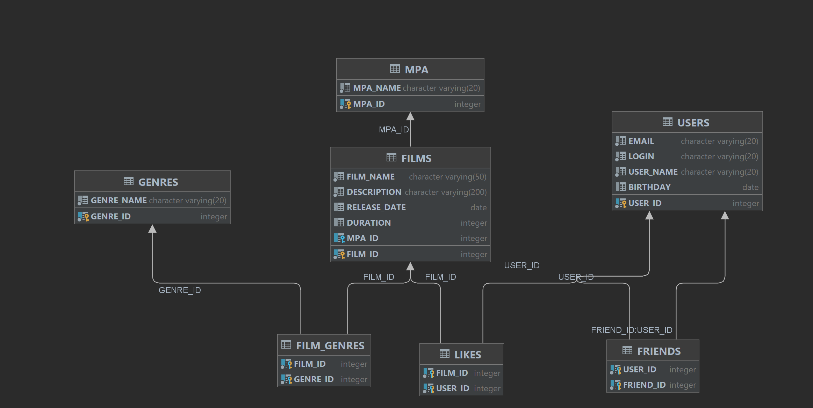

# java-filmorate
Template repository for Filmorate project.

The monolith application that works with movies and user ratings, as well as return the top 5 movies recommended for viewing. In this project, at the last stage, team development was carried out (a group of students of 5 people). REST services using Spring Boot, Maven, Lombook, DB interaction (H2) using JDBC.
